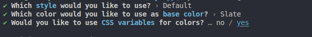

# Projet personnel (work in progress...)

**Objectifs**

-   Création d'un Portfolio
-   Apprendre et approfondir l'utilisation d'outils
    -   Next.js _(un framework React)_
    -   Shadcn-ui _(une collection de composants réutilisables)_
    -   Tailwindcss _(un framework CSS utility-first)_
    -   React.js _(une bibliothèque JavaScript)_

**Documentations**

-   https://ui.shadcn.com/
-   https://tailwindcss.com/
-   https://fr.legacy.reactjs.org/
-   https://developer.mozilla.org/fr/

## Mise en place

Création d'un projet Next.js :

```
npx create-next-app@latest portfolio
```


Configurer le projet avec shadcn-ui :

```
npx shadcn-ui@latest init
```



Ajout de composants :

```
npx shadcn-ui@latest add nom-du-components
```

La commande ci-dessus crée un dossier "components/ui" contenant des fichiers au format .jsx.

_Exemple => button.jsx - input.jsx - sheet.jsx_

Ces fichiers sont des composants modifiables et réutilisables au cours de la création de votre projet.

Pour voir tous les composants disponibles => la superbe documentation sur ui.shadcn.com/

## Création Homepage et Header responsive

Work in progress...
