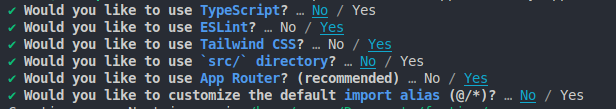

# Projet personnel (work in progress...)

**Objectifs**

-   Création d'un Portfolio
-   Apprendre et approfondir l'utilisation d'outils
    -   Next.js _(un framework React)_
    -   Shadcn-ui _(une collection de composants réutilisables)_
    -   Tailwindcss _(un framework CSS utility-first)_
    -   React.js _(une bibliothèque JavaScript)_

**Documentations**

-   https://ui.shadcn.com/
-   https://tailwindcss.com/
-   https://fr.legacy.reactjs.org/
-   https://developer.mozilla.org/fr/

**Description**

Je me sers de la création de ce portfolio comme d'une opportunité pour renforcer mes compétences techniques. Plutôt que de me limiter aux outils et aux technologies que je maîtrise déjà, j'ai choisi d'explorer et d'apprendre de nouvelles technologies au cours de ce projet. Ce **README.md** n'a pas vocation à être un tutoriel détaillant chaque étape de la création de l'application web, mais plutôt un journal de bord de mon processus d'apprentissage et de développement. Il reflète mon approche proactive pour élargir mes compétences.

## Mise en place

Création d'un projet Next.js :

```
npx create-next-app@latest portfolio
```

<details>
<summary>Configuration</summary>



</details>

Configurer le projet avec shadcn-ui :

```
npx shadcn-ui@latest init
```

<details>
<summary>Configuration</summary>


</details>

Ajout de composants :

```
npx shadcn-ui@latest add nom-du-components
```

<details>
  <summary>Détails</summary>

La commande ci-dessus crée un dossier "**components/ui**" contenant des fichiers au format .jsx.

_Exemple => **button.jsx** - **input.jsx** - **sheet.jsx**_

Ces fichiers sont des composants modifiables et réutilisables au cours de la création de votre projet.

Pour voir tous les composants disponibles => la superbe documentation sur ui.shadcn.com/

</details>

## Création Header responsive + Routage

Dans mon dossier **app**, je crée pour chaque route de mon portfolio un dossier portant le nom de celle-ci. Et je crée pour chacun de ces dossiers un fichier **page.jsx**.

<details>

<summary>Routage avec Next.js</summary>

**Next.js uses a file-system based router where:**

Folders are used to define routes. A route is a single path of nested folders,
following the file-system hierarchy from the root folder down to a final leaf folder that includes a page.js file. See Defining Routes.
Files are used to create UI that is shown for a route segment. See special files.

https://nextjs.org/docs/app/building-your-application/routing

</details>

Dans mon dossier "components" je crée un fichier **Header.jsx**, que j'importe dans mon **layout.jsx**. Ainsi mon header sera présent sur toutes mes pages.

<details>
<summary>Code</summary>

```JS
/** J'importe mon composant pour pouvoir l'utiliser **/
import Header from "@/components/Header";

export default function RootLayout({ children }) {
    return (
        <html lang="fr">
            <body className={cn("font-primary", rubik.variable)}>
/** Je l'utilise via la balise suivante **/
                <Header />
                {children}
            </body>
        </html>
);
};
```

</details>

À nouveaux, je crée deux composants _(**Nav.jsx** et **MobileNav.jsx**)_ qui serviront à réaliser mon menu de navigation et la navigation sur mobile _(le classique hamburger menu)_. Je les intègre dans mon **Header.jsx**.

<details>
<summary>Code</summary>

```JS
import Link from "next/link";

//Components
import Nav from "./Nav";
import MobileNav from "./MobileNav";

const Header = () => {
    return (
        <header className="py-8 lg:py-12">
            <div className="container mx-auto flex justify-between items-center">
                <Link href="/">
                    <h1 className="text-4xl font-semibold">
                        Sacha <span className="text-primary">.</span>
                    </h1>
                </Link>

                {/* DesktopNav */}
                <div className="hidden lg:flex items-center gap-8">
                    <Nav />
                </div>

                {/* MobileNav */}
                <div className=" lg:hidden">
                    <MobileNav />
                </div>
            </div>
        </header>
    );
};

export default Header;
```

</details>

**Au cours des étapes ci-dessus, j'ai appris :**

-   Les principes fondamentaux du routage avec Next.js\
    (https://nextjs.org/docs/app/building-your-application/routing)

-   L'utilisation des composants avec React\
    (https://fr.react.dev/learn/your-first-component)

-   L'utilsation du composant React "Link"\
  (https://nextjs.org/docs/app/api-reference/components/link)

-   L'utilisation du client component "usePathname"\
    (https://nextjs.org/docs/app/api-reference/functions/use-pathname)

-   L'utilisation du composant Shadcn-ui "Sheet"\
    (https://ui.shadcn.com/docs/components/sheet)
